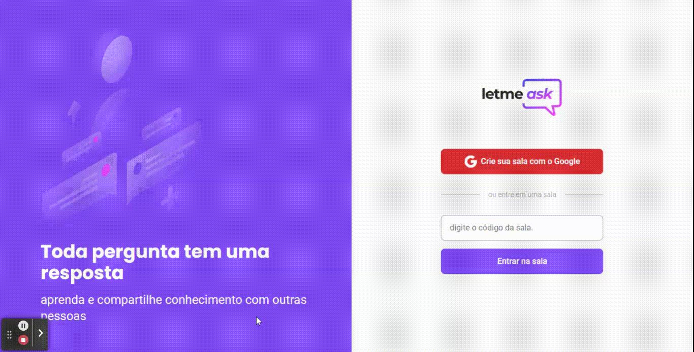

# Let Me Ask

## 💻 Sobre o projeto

O projeto Let Me Ask foi criado durante a [Next Level Week 6](https://nextlevelweek.com/inscricao/6) da [Rocketseat](https://rocketseat.com.br/). O objetivo era desenvolver uma aplicação que permite a criação de salas de perguntas.

🌐 [Página do Projeto](https://letmeask-29bf0.web.app/)

---

## 🖼️ Imagens

  

---

## Funcionalidades

- Tela de login;
- Tela de criação de sala;
- Tela de perguntas e
- Tela de administrador da sala.

---

## 🛠 Tecnologias

As seguintes ferramentas foram usadas na construção do projeto:

-   [Reactjs](https://pt-br.reactjs.org/)
-   [TypeScript](https://www.typescriptlang.org/)
-   [SASS](https://sass-lang.com/)
-   [Firebase](https://firebase.google.com/?hl=pt)

---

🌐 [Ver a página do Projeto](https://letmeask-29bf0.web.app/)

---

Desenvolvido por [Alana Bacco](https://github.com/alanabacco).  
